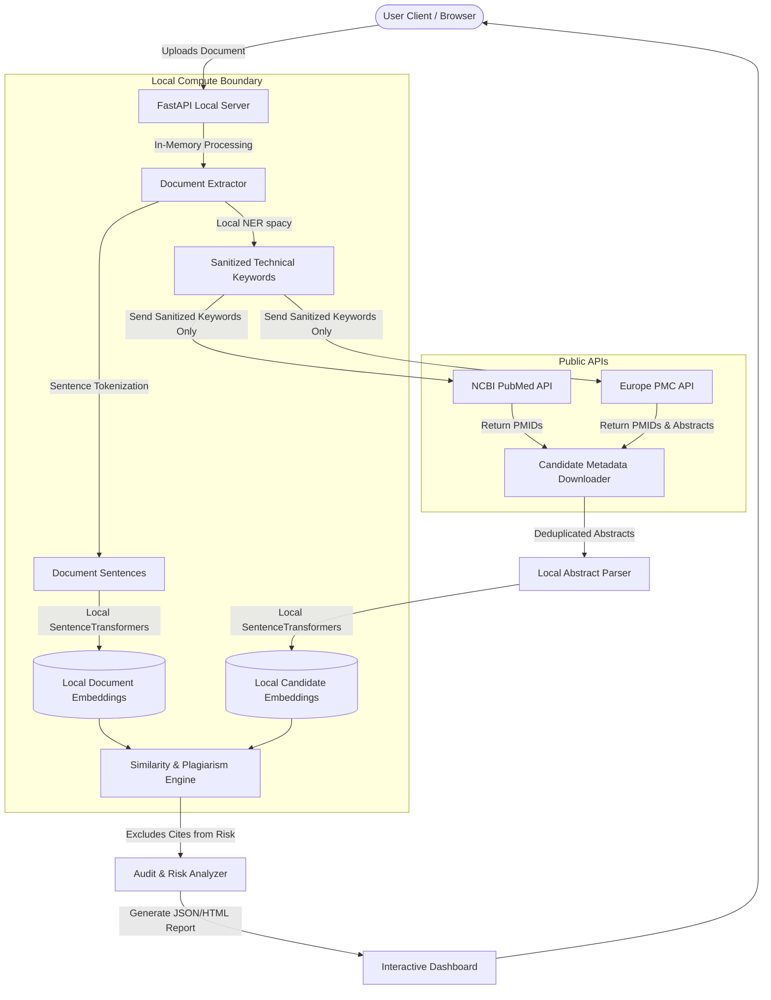

# Secure & Confidential Research Plagiarism & Similarity Engine

A secure, local-first academic plagiarism and semantic similarity checker designed specifically for confidential documents. This tool evaluates research papers against PubMed and Europe PMC databases without ever leaking the original text or phrasing to the external network.

---

## 🛡️ Core Confidentiality Guardrails

To ensure that the uploaded document **never reaches the outside world** and is not mixed across sessions, the system enforces the following security boundaries:

1. **Local-First Processing**: Text parsing, sentence tokenization, vector embedding generation, and Jaccard shingle comparisons are executed entirely on local CPU/GPU memory. No external LLM or AI cloud APIs are used.
2. **In-Memory Ephemeral Storage**: Uploaded files are processed in-memory. Raw document texts are never persisted to disk or databases.
3. **Anonymized External Queries**: The system never sends sentences, paragraphs, or grammatical fragments to search indexes. Instead, it runs local Named Entity Recognition (NER) to extract isolated keywords (e.g., drug names, genes, diseases). 
4. **Leak-Proof Query Construction**: Extracted keywords are strictly validated: no phrase is allowed to be longer than 3 words, and all common pronouns, verbs, and PII are stripped. Only these anonymous technical concepts are sent to NCBI PubMed and Europe PMC APIs to discover candidate matching articles.

---

## 🏗️ Technical Architecture & Data Flow

The following diagram illustrates the security boundary separating local computations from the external web:



---

## 💻 Technology Stack

### Backend (Python 3.10+)
- **FastAPI**: Lightweight, high-performance web API framework.
- **Uvicorn**: ASGI server implementation for hosting the FastAPI endpoints.
- **python-multipart**: Required by FastAPI to parse multipart file uploads from the dashboard UI.
- **spaCy (`en_core_web_sm`)**: For local sentence tokenization and Named Entity Recognition (NER) keyword extraction.
- **Sentence-Transformers (`all-MiniLM-L6-v2`)**: Local Siamese network embeddings model for calculating high-accuracy semantic similarity (running locally on CPU/GPU).
- **pypdf & python-docx**: For in-memory text extraction from PDFs and Word documents.
- **pytest**: For unit and integration tests.

### Frontend
- **HTML5, CSS3 (Vanilla)**: Glassmorphic dark-theme, responsive cards, sidebar components, and custom color mappings.
- **JavaScript (Vanilla)**: Asynchronous form submission, progress steps status trackers, SVG risk gauge ring updates, and dynamic tab switching.

---

## 🔗 Integrated Academic Databases

1. **NCBI PubMed E-Utilities**:
   - `esearch`: Discovers matching PubMed IDs (PMIDs) based on anonymized keywords.
   - `efetch`: Downloads XML abstracts and metadata for the discovered PMIDs.
2. **Europe PMC (European Bioinformatics Institute)**:
   - `search`: Queries open-access and preprint indexes for biology and medicine using `resultType=core` to fetch detailed abstracts, PMIDs, PMCIDs, and DOIs in a single request.
3. **Smart Deduplication Engine**:
   - Merges results from both databases and filters out duplicates based on PMID, DOI, or normalized Title.

---

## 🚦 Smart Citation Identification

Plagiarism checkers often flag correctly cited references as copied material. This system implements an intelligent **Citation Filter**:
- It runs local heuristic parsing to detect if the candidate paper's DOI, title keywords, or first author's last name (e.g. *Linz*, *Schwark*) are mentioned in the text (e.g. `"...Linz et al. [45]..."`).
- **Cited matches** are displayed in **green** with an `"Already Cited"` badge.
- **Uncited matches** (potential issues) are grouped separately in red/yellow.
- Cited matches are **excluded from risk score calculations**, ensuring legitimate citations do not skew your document's similarity rating.

---

## 🚀 Installation & Setup

### 1. Initialize Virtual Environment
Create a virtual environment to prevent global package pollutions:
```bash
python -m venv .venv
```

### 2. Activate the Environment
- **Windows PowerShell**:
  ```powershell
  .venv\Scripts\Activate.ps1
  ```
- **Linux/macOS**:
  ```bash
  source .venv/bin/activate
  ```

### 3. Install Dependencies
Install all package requirements:
```bash
pip install -r requirements.txt
```

### 4. Download NLP Model
Download the English language processing model for spaCy:
```bash
python -m spacy download en_core_web_sm
```

---

## 🛠️ Usage Guidelines

### 1. Launching the Web Dashboard & API
Start the local server using Uvicorn:
```bash
python -m uvicorn src.api:app --host 127.0.0.1 --port 8000 --reload
```
Open **[http://127.0.0.1:8000](http://127.0.0.1:8000)** in your browser. 
- **Sticky Reset Button**: To scan another document, click **"Analyze Another Document"** in the top-right header menu without scrolling.

### 2. Running via the Command Line Interface (CLI)
You can run a local terminal scan on any document:
```bash
python -m src.cli path/to/document.pdf
```
To export the report directly as a JSON file:
```bash
python -m src.cli path/to/document.pdf --output report.json
```

### 3. Running Automated Tests
Run unit tests to verify database parsers, encoders, and guardrails:
```bash
python -m pytest tests/
```

---

## 🌐 API Usage Documentation

FastAPI automatically generates interactive Swagger API documentation when the server is running. You can explore and execute live requests directly in your browser at:
- **Swagger UI**: [http://127.0.0.1:8000/docs](http://127.0.0.1:8000/docs)
- **ReDoc**: [http://127.0.0.1:8000/redoc](http://127.0.0.1:8000/redoc)

### Endpoint: Analyze Document
Uploads a local document (PDF, Word, or TXT) in-memory, scrubs confidentiality keywords, queries PubMed and Europe PMC databases, and runs local similarity scans.

- **Method**: `POST`
- **Path**: `/api/analyze`
- **Headers**: `Content-Type: multipart/form-data`
- **Request Body (form-data)**:
  - `file`: (binary) The PDF, DOCX, or TXT file to analyze.

#### Example Request (cURL)
```bash
curl -X POST "http://127.0.0.1:8000/api/analyze" \
  -H "accept: application/json" \
  -H "Content-Type: multipart/form-data" \
  -F "file=@/path/to/my_research_paper.pdf"
```

#### Example Request (Python)
```python
import requests

url = "http://127.0.0.1:8000/api/analyze"
file_path = "my_research_paper.pdf"

with open(file_path, "rb") as f:
    files = {"file": (file_path, f, "application/pdf")}
    response = requests.post(url, files=files)
    
if response.status_code == 200:
    report = response.json()
    print("Risk Level:", report["plagiarism_risk"]["level"])
else:
    print("Error:", response.json())
```

#### Example Response (JSON)
```json
{
  "status": "success",
  "metadata": {
    "filename": "my_research_paper.pdf",
    "word_count": 1067,
    "sentences_analyzed": 48,
    "execution_time_seconds": 2.14
  },
  "guardrails": {
    "confidentiality_status": "SECURE",
    "anonymized_search_keywords": ["ranibizumab", "retinopathy", "implant"],
    "external_pmids_queried": ["35859876", "38140067"]
  },
  "plagiarism_risk": {
    "level": "LOW",
    "uncited_semantic_matches_count": 0,
    "uncited_verbatim_matches_count": 0
  },
  "results": {
    "verbatim_matches": [
      {
        "pmid": "35859876",
        "title": "Discovery of Tenapanor: A First-in-Class Minimally...",
        "doi": "10.1021/acs.jmedchem.2c00324",
        "is_cited": true,
        "jaccard_score": 0.83,
        "matching_phrases": [
          "To our knowledge, Tenapanor is the only NHE3 inhibitor..."
        ]
      }
    ],
    "semantic_matches": [
      {
        "pmid": "38140067",
        "title": "Physiologically Based Biopharmaceutics Model...",
        "doi": "10.1007/s11095-023-03612-4",
        "is_cited": false,
        "similarity_score": 0.78,
        "source_sentence": "Tenapanor moves between 20 and 50 mEq of sodium into stool...",
        "candidate_sentence": "The presented model successfully predicted both urine and stool sodium..."
      }
    ]
  }
}
```

---

## 🔒 Verification & Privacy Audit

The codebase includes an automated audit script to trace outbound traffic and ensure zero data leaks. To run the confidentiality audit:
```bash
python scratch/check_guardrails.py
```
This script runs the analysis on a sample confidential paragraph, intercepts outbound requests, and asserts that:
- No sentences appear in any query parameters.
- Only isolated keywords are transmitted.
- Output: `[OK] CONFIDENTIALITY VALIDATED: 100% LEAK-PROOF`.
