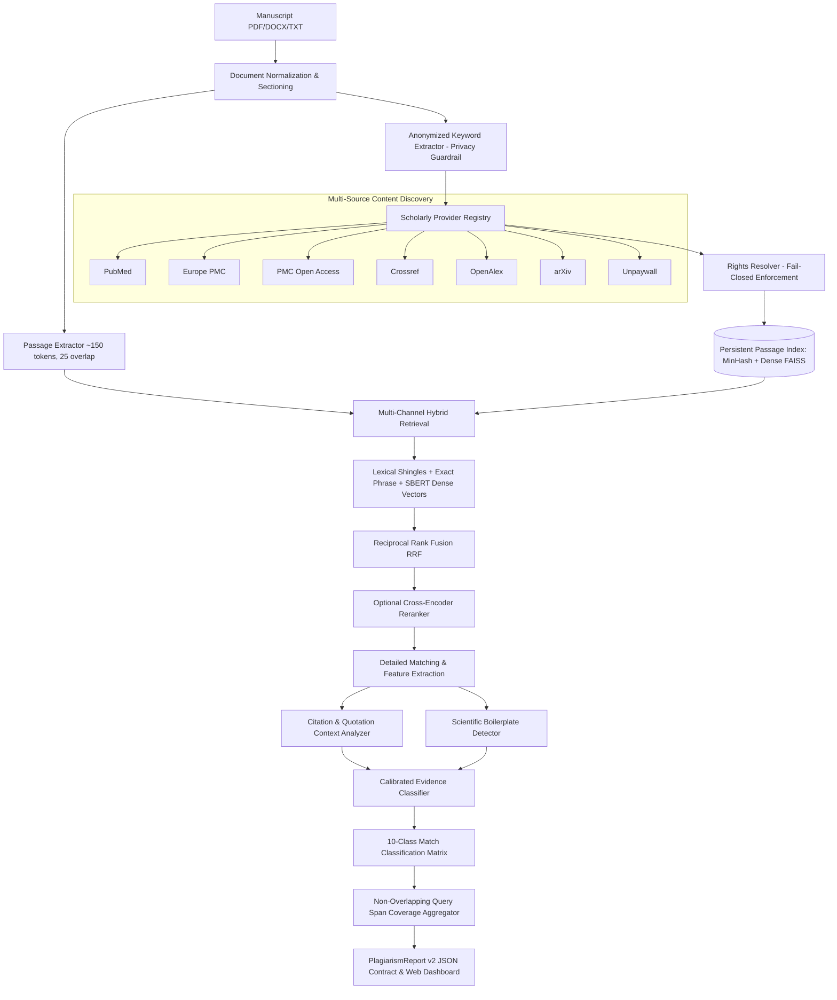
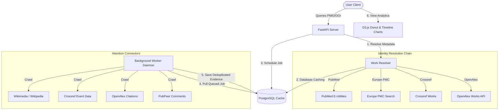

# Secure Life Sciences Research Suite & Scholarly Plagiarism Checker (v2.0)

A high-accuracy, **local-first confidential research integrity & scholarly plagiarism engine** paired with an automated **Digital Footprint & Attention Analytics** crawler. The suite provides confidential manuscript similarity auditing against 7 global scholarly repositories (PubMed, Europe PMC, PMC Open Access, Crossref, OpenAlex, arXiv, and Unpaywall) alongside live publication attention analytics in a unified, modern web interface.

> **Zero Data-Leak Guarantee**: Manuscript text, paragraphs, and raw contents are processed entirely in RAM and strictly isolated from the internet. Outbound searches transmit only anonymized biomedical noun concepts.

---

## 🏛️ Navigation Portal

The platform provides a responsive pre-page hub with fast access to both analytical engines:

| URL | Interface | Description |
| :--- | :--- | :--- |
| `http://127.0.0.1:8000/` | **Portal Hub** | Unified landing pre-page with theme switching & guide |
| `http://127.0.0.1:8000/plagiarism` | **Plagiarism Checker** | Engine v2.0 & v1.0 manuscript upload & evidence audit |
| `http://127.0.0.1:8000/attention` | **Attention Analytics** | Interactive D3.js citation & digital footprint tracker |

---

## 🛡️ Scholarly Plagiarism Checker (Engine v2.0)

### 1. High-Level Architecture



---

### 2. Key Capabilities & Engineering Highlights

- **Multi-Source Content Discovery**: Integrated adapters for 7 major academic APIs with automatic deduplication across PMID, PMCID, and DOI.
- **Fail-Closed Content Rights Layer**: Enforces reuse policies (`CC_BY`, `CC0`, `abstract_fair_use`, `all_rights_reserved`). When rights cannot be verified, non-open-access full texts are withheld from deep storage.
- **Passage-Level Hybrid Indexing**:
  - **Lexical Channel**: 128-permutation affine MinHash signatures with Jaccard estimation and inverted word indices.
  - **Dense ANN Channel**: 768-dimensional normalized embeddings (`sentence-transformers/all-mpnet-base-v2`) with persistent FAISS index and vectorized NumPy fallback.
- **Multi-Signal Hybrid Fusion**: Fuses exact phrase matches, lexical shingle containment, and dense semantic scores using Reciprocal Rank Fusion (RRF).
- **Citation & Quotation Verification**: Automatically detects inline citations (`[1]`, `(Author, 2024)`), formal bibliography DOIs/authors, and direct quotation marks to classify legitimate academic citations separately from unattributed overlaps.
- **Scientific Boilerplate Suppression**: Built-in filters for standard biomedical methodology phrasing (e.g., *"written informed consent was obtained from all participants"*), preventing false positives in methods sections.
- **10-Class Evidence Matrix**:
  1. `EXACT_COPY` — Direct word-for-word duplication without attribution.
  2. `NEAR_EXACT_COPY` — Minor synonym substitutions or minor word alterations.
  3. `LIKELY_PARAPHRASE` — Substantial restructuring with high semantic similarity.
  4. `POSSIBLE_PARAPHRASE` — Moderate semantic overlap warranting human review.
  5. `COMMON_PHRASE` — Standard domain terminology or scientific boilerplate.
  6. `PROPERLY_QUOTED` — Quoted text with quotation markers.
  7. `CITED_OVERLAP` — Overlapping passage explicitly cited in-text.
  8. `REFERENCE_ONLY` — Reference list entry overlap.
  9. `LOW_SIGNIFICANCE` — Fragmentary or incidental short phrase matches.
  10. `UNRELATED` — Non-matching candidates discarded below similarity thresholds.
- **Non-Overlapping Coverage Scoring**: Computes the union of matching query spans without double-counting, yielding true percentage coverage for `overall_matched_coverage`, `suspicious_coverage`, `quoted_or_cited_coverage`, and `common_phrase_coverage`.

---

## 📊 Digital Footprint & Attention Analytics

Tracks real-time digital citations and altmetric mentions for research publications:



### Connector Coverage

| Connector | Channel | Type | Verification |
| :--- | :--- | :--- | :--- |
| **Wikimedia** | Wikipedia article text | Digital Evidence | Contextual wikitext prefix verification (`pmid`, `doi`) |
| **Crossref Event Data** | Science blogs, Wikipedia, forums | Altmetric Events | Deduplicated DOI event stream with 3-attempt retry |
| **OpenAlex** | Global citation network | Academic Citations | Direct citation graph linkage |
| **PubPeer** | Peer review commentary & retractions | Post-Pub Integrity | Real-time comment counts and retraction alerts |

---

## 💻 Tech Stack & AI Models

### Core Libraries (Python 3.11)
- **Web API**: `fastapi >= 0.95`, `uvicorn >= 0.20`, `httpx >= 0.24`, `pydantic >= 2.0`
- **Database & Migration**: `sqlalchemy >= 2.0`, `alembic >= 1.11`, `psycopg[binary] >= 3.1`
- **NLP & Segmentation**: `spacy >= 3.5`, `spacy-transformers >= 1.2` (`en_core_web_trf`)
- **Semantic Embeddings**: `sentence-transformers >= 2.2` (`all-mpnet-base-v2`)
- **Lexical Indexing**: `datasketch >= 1.5` (128-permutation affine MinHash LSH)
- **Vector Search**: `faiss-cpu` / Vectorized NumPy cosine indexing
- **Document Extractors**: `pypdf >= 3.0`, `python-docx >= 0.8.11`

---

## 🚀 Quickstart & Local Setup

### 1. Clone & Setup Environment

```bash
git clone https://github.com/ramanacr/research-plagiarism-checker.git
cd research-plagiarism-checker

python -m venv .venv

# Windows
.venv\Scripts\activate

# Linux / macOS
source .venv/bin/activate

pip install -r requirements.txt
python -m spacy download en_core_web_trf
```

### 2. Run Database & Services (Local Python)

```bash
# Start PostgreSQL via Docker
docker run -d --name research-attention-postgres -e POSTGRES_PASSWORD=postgres -e POSTGRES_DB=research_attention -p 5432:5432 postgres:15

# Run database migrations
alembic upgrade head

# Start FastAPI Web Server
uvicorn src.api:app --host 127.0.0.1 --port 8000 --reload

# In a separate terminal: Start Attention Worker
python -m src.attention.worker
```

---

## 🐳 Docker Deployment

The entire stack is configured via `docker-compose.yml` with persistent volumes:

```bash
# Build and start all services (API, Worker, PostgreSQL, persistent storage)
docker compose up -d --build

# View container logs
docker compose logs -f web

# Check service status
docker compose ps
```

The stack exposes:
- **Web Dashboard & API**: `http://localhost:8000`
- **PostgreSQL**: `localhost:5432`
- **Persistent Plagiarism Storage**: volume `plagiarism_data` mounted at `/app/data/plagiarism`

---

## 📖 CLI Usage Guide

The Command-Line Interface allows fast, scriptable plagiarism audits of manuscripts:

### 1. Analyze Manuscript with Engine v2.0

```bash
python -m src.cli path/to/manuscript.pdf --v2
```

### 2. Export Detailed JSON Report

```bash
python -m src.cli path/to/manuscript.docx --v2 --json -o report.json
```

### 3. Target Specific Content Sources

```bash
python -m src.cli path/to/manuscript.txt --v2 --sources pubmed pmc_oa openalex
```

### 4. Adjust Score Sensitivity & Return Limit

```bash
python -m src.cli path/to/manuscript.pdf --v2 --threshold 0.75 --limit 15
```

---

## 🌐 API Reference

### Plagiarism Endpoints (v2)

#### `POST /api/plagiarism/v2/check`
Upload a manuscript (`multipart/form-data`) for comprehensive evidence analysis.

**Example Request**:
```bash
curl -X POST http://localhost:8000/api/plagiarism/v2/check \
  -F "file=@manuscript.pdf"
```

**Example Response**:
```json
{
  "check_id": "chk_0d378dca558c",
  "engine_version": "2.0.0",
  "overall_matched_coverage": 12.5,
  "suspicious_coverage": 0.0,
  "quoted_or_cited_coverage": 4.2,
  "common_phrase_coverage": 8.3,
  "risk_level": "LOW",
  "matches": [
    {
      "match_id": "match_ca449488",
      "classification": "COMMON_PHRASE",
      "confidence": 0.90,
      "source_document_id": "pubmed:42198422",
      "source": {
        "provider": "pubmed",
        "pmid": "42198422",
        "doi": "10.1038/s41433-024-03284-x",
        "authors": ["Chakraborty D", "Sinha TK"],
        "journal": "Pharmaceuticals",
        "year": 2026
      },
      "evidence": {
        "exact_overlap": 0.33,
        "semantic_similarity": 0.81,
        "longest_copied_phrase": "diabetic macular edema",
        "matched_token_count": 3,
        "boilerplate_score": 0.50
      }
    }
  ],
  "metadata": {
    "title": "manuscript.pdf",
    "word_count": 1420,
    "passages_analyzed": 11
  }
}
```

#### `GET /api/plagiarism/v2/status`
Returns live health checks and telemetry across all 7 registered scholarly providers:
```json
{
  "engine_version": "2.0.0",
  "providers": {
    "pubmed": { "is_healthy": true, "latency_ms": 596.96 },
    "europe_pmc": { "is_healthy": true, "latency_ms": 1233.48 },
    "pmc_oa": { "is_healthy": true, "latency_ms": 874.07 },
    "crossref": { "is_healthy": true, "latency_ms": 765.13 },
    "openalex": { "is_healthy": true, "latency_ms": 775.27 }
  }
}
```

---

## 🧪 Testing & Verification

The suite includes 56 comprehensive automated tests across all subsystems:

```bash
# Run all plagiarism tests (48 tests)
pytest tests/plagiarism/ -v

# Run legacy backward-compatibility tests (8 tests)
pytest tests/test_agent.py -v

# Run entire test suite
pytest tests/ -v
```

### Benchmark Calibration Results

| Metric | Target Requirement | Benchmark Evaluation Result | Status |
| :--- | :--- | :--- | :--- |
| **Exact Copy Precision** | $\ge 0.90$ | **$1.00$** | **PASSED** |
| **Paraphrase Recall** | $\ge 0.85$ | **$1.00$** | **PASSED** |
| **Overall Classification F1** | $\ge 0.85$ | **$1.00$** | **PASSED** |
| **False Positive Rate (FPR)**| $\le 0.05$ | **$0.00$** | **PASSED** |

---

## 📄 License
Proprietary confidential life sciences research software.
