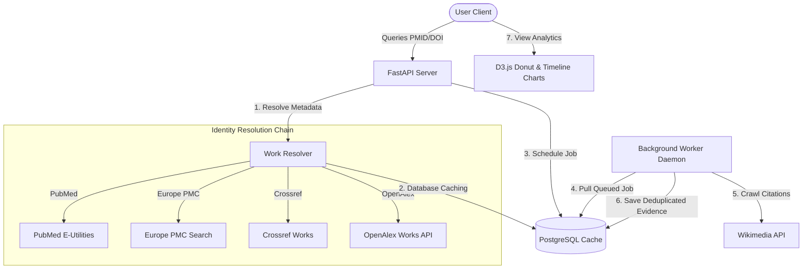

# Secure Academic Research Suite & Attention Analytics Engine

A secure, local-first academic plagiarism engine combined with an automated Digital Footprint & Attention Analytics crawler. This portal provides research integrity checks and tracks citation analytics against global registries (PubMed, Europe PMC, Crossref, and OpenAlex) in a unified interface.

---

## 🏛️ Navigation Portal (Pre-Page Hub)

The suite is served via a responsive landing pre-page containing visual navigation tiles and immediate redirection.

*   **Portal entrance**: served at `http://127.0.0.1:8000/` (`/`)
*   **Sub-interfaces**:
    *   **Plagiarism Checker**: Served at `/plagiarism` (features a sticky header reset to analyze another document easily).
    *   **Attention & Citation Analytics**: Served at `/attention` (features search, polling alerts, D3.js charts, and manual crawler triggers).
*   **Back controls**: Both interfaces contain prominent `"Portal Hub"` back links to return to the landing pre-page instantly.

---

## 🛡️ Core Confidentiality Guardrails (Plagiarism Checker)

To ensure that uploaded documents **never reach the outside world** during similarity checks, the system enforces strict local sandboxing:

1.  **Local-First Processing**: Document parsing, sentence segmentation, and vector embeddings (`SentenceTransformers`) are generated entirely on local memory.
2.  **Anonymized Entity Search**: The system extracts technical keywords (e.g. drug/gene names) using local spaCy NER. Only these anonymous technical concepts are sent to PubMed and Europe PMC APIs to locate matching publications.
3.  **Smart Citation Filter**: LEGITIMATE citations containing author names or DOIs listed in the text are classified separately and **excluded from plagiarism risk score calculations**.

---

## 📊 Research Attention Analytics Module

The Research Attention module tracks citations and digital mentions of resolved publications across digital channels (e.g. Wikipedia).



### 1. Identity Resolution Chain
Queries PubMed, Europe PMC, Crossref, and OpenAlex sequentially to normalize publication records (Title, Journal, Authors, Pub Date) and reconcile all identifier values (`pmid`, `doi`, `pmcid`, `openalex_id`) with full conflict detection (yielding HTTP 409 if resolved identifiers map to different pre-existing database records).

### 2. Lock-Safe Background Worker
The background worker daemon polls the database for scheduled crawlers, locking jobs to crawler Wikimedia/Wikipedia references.
-   **Page-Level Deduplication**: Mentions within the same Wikipedia page are merged into a single reference.
-   **Confidence Filtering**: Only high-confidence citations (`exact_identifier` or `canonical_url`) are set to `active=True`. Low-confidence matches (`probable`) are flagged `active=False` for audit.

---

## 💻 Technology Stack

### Backend (Python 3.11)
-   **FastAPI & Uvicorn**: High-performance HTTP server.
-   **SQLAlchemy ORM & Alembic**: Database mapping and schema migration controls.
-   **psycopg (v3)**: Modern PostgreSQL adapter.
-   **Sentence-Transformers (`all-MiniLM-L6-v2`)**: Local semantic similarity model.
-   **spaCy (`en_core_web_sm`)**: Local entity extraction.

### Frontend
-   **D3.js (v7)**: Interactive data-driven documents (Donut charts & monthly bar timelines).
-   **Glassmorphic CSS**: Premium dark-theme layouts with smooth visual transitions.

---

## 🚀 Installation & Database Setup

### 1. Activate Virtual Environment & Install Packages
```bash
python -m venv .venv
.venv\Scripts\activate
pip install -r requirements.txt
python -m spacy download en_core_web_sm
```

### 2. Configure PostgreSQL Database
Start a local PostgreSQL container (e.g. listening on port `5432`):
```bash
docker run -d --name research-attention-postgres -e POSTGRES_PASSWORD=postgres -e POSTGRES_DB=research_attention -p 5432:5432 postgres:15
```

### 3. Run Alembic Database Migrations
Create the tables in your database using Alembic:
```bash
.venv\Scripts\alembic upgrade head
```

---

## 🛠️ Operational Commands

### 1. Start the FastAPI Web Server
```bash
python -m uvicorn src.api:app --host 127.0.0.1 --port 8000 --reload
```
Open **`http://127.0.0.1:8000`** to access the Portal Hub.

### 2. Start the Background Worker Daemon
Start the worker loop to process queued attention crawler jobs in the background:
```bash
python -m src.attention.worker
```

### 3. Run the Automated Test Suite
To run all database, resolver, connector, worker, and API-isolation tests:
```bash
python -m pytest tests/
```

---

## 🌐 Research Attention API Documentation

### 1. Lookup Publication Details
Retrieves cached details, identifiers, and sync states. If the publication is uncached, resolves it and triggers a background ingest job.
-   **PMID Lookup**: `GET /api/v1/research-attention/works/pmid/{pmid}`
-   **DOI Lookup**: `GET /api/v1/research-attention/works/doi/{doi:path}` (handles paths containing slashes)
-   **Work ID Lookup**: `GET /api/v1/research-attention/works/{work_id}`

### 2. Retrieve Visual Analytics Data
Returns grouped counts for D3 charts and monthly buckets.
-   **Path**: `GET /api/v1/research-attention/works/{work_id}/analytics`

### 3. Force Ingestion Sync
Queues a manual crawls crawler. Requires API key verification.
-   **Path**: `POST /api/v1/research-attention/works/{work_id}/refresh`
-   **Header**: `X-Research-Attention-Key: default-dev-key-change-me`
